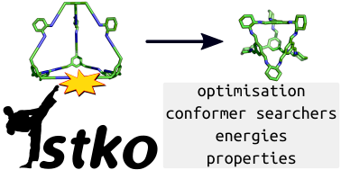

:maintainers:
    `andrewtarzia <https://github.com/andrewtarzia/>`_,
    `lukasturcani <https://github.com/lukasturcani/>`_
:documentation: https://stko-docs.readthedocs.io
:discord: https://discord.gg/zbCUzuxe2B



.. image:: https://readthedocs.org/projects/stko-docs/badge/?version=latest
    :target: https://stko-docs.readthedocs.io/en/latest/?badge=latest
    :alt: Documentation Status

Overview
========

``stko`` is a Python library which allows for the optimisation and
property calculation of molecules constructed using the library
``stk`` https://github.com/lukasturcani/stk. There is a Discord server
for ``stk``, which can be joined through https://discord.gg/zbCUzuxe2B.


Installation
============

To get ``stko``, you can install it with pip:

.. code-block:: bash

  pip install stko

Some optional dependencies are only available through conda:

.. code-block:: bash

  # for OpenMM
  mamba install openff-toolkit openmm openmmtools
  # for xtb
  mamba install xtb
  # for openbabel
  mamba install openbabel
  # for mdanalysis
  mamba install mdanalysis

Examples
========

We are constantly trying to add examples to the ``examples/`` directory
and maintain examples in the doc strings of ``Calculator`` and
``Optimizer`` classes.

``examples/basic_examples.py`` highlights basic optimisation with
``rdkit``, ``openbabel`` and ``xtb`` (if you have ``xtb`` available).


How To Contribute
=================

If you have any questions or find problems with the code, please submit
an issue.

If you wish to add your own code to this repository, please send us a
Pull Request. Please maintain the testing and style that is used
throughout ```stko``.


How To Cite
===========

If you use ``stko`` please cite

    https://github.com/JelfsMaterialsGroup/stko


Acknowledgements
================

We developed this code when working in the Jelfs group,
http://www.jelfs-group.org/, whose members often provide very valuable
feedback, which we gratefully acknowledge.
