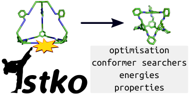

:author: Steven Bennett, Andrew Tarzia, Lukas Turcani
:Documentation: https://stko-docs.readthedocs.io

Contains molecular optimizers and property calculators for use with stk, https://github.com/lukasturcani/stk.



.. image:: https://readthedocs.org/projects/stko-docs/badge/?version=latest
    :target: https://stko-docs.readthedocs.io/en/latest/?badge=latest
    :alt: Documentation Status

Overview
========

``stko`` is a Python library which allows for the optimisation and
property calculation of molecules constructed using the library
``stk`` https://github.com/lukasturcani/stk.


Installation
============

To get ``stko``, you can install it with pip::

    $ pip install stko

Make sure you also install rdkit, which is a dependency::

    $ conda install -c conda-forge rdkit

MDAnalysis is an optional dependancies::

    $ pip install MDAnalysis

Examples
========

We are constantly trying to add examples to the ``examples/`` directory
and maintain examples in the doc strings of ``Calculator`` and
``Optimizer`` classes.

``examples/basic_examples.py`` highlights basic optimisation with
``rdkit`` and ``xtb`` (if you have ``xtb`` available).


How To Contribute
=================

If you have any questions or find problems with the code, please submit
an issue.

If you wish to add your own code to this repository, please send us a
Pull Request. Please maintain the testing and style that is used
throughout ```stko``.


How To Cite
===========

If you use ``stko`` please cite

    https://github.com/JelfsMaterialsGroup/stko


Acknowledgements
================

We developed this code when working in the Jelfs group,
http://www.jelfs-group.org/, whose members often provide very valuable
feedback, which I gratefully acknowledge.